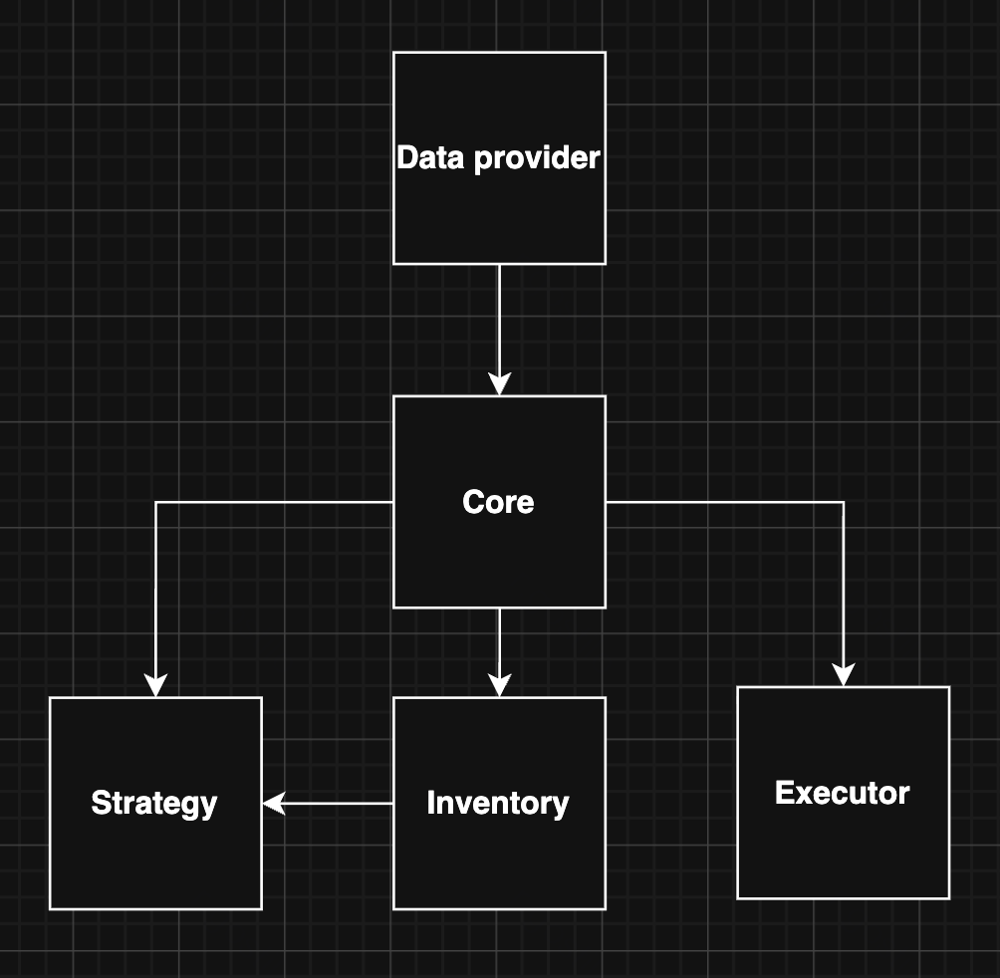
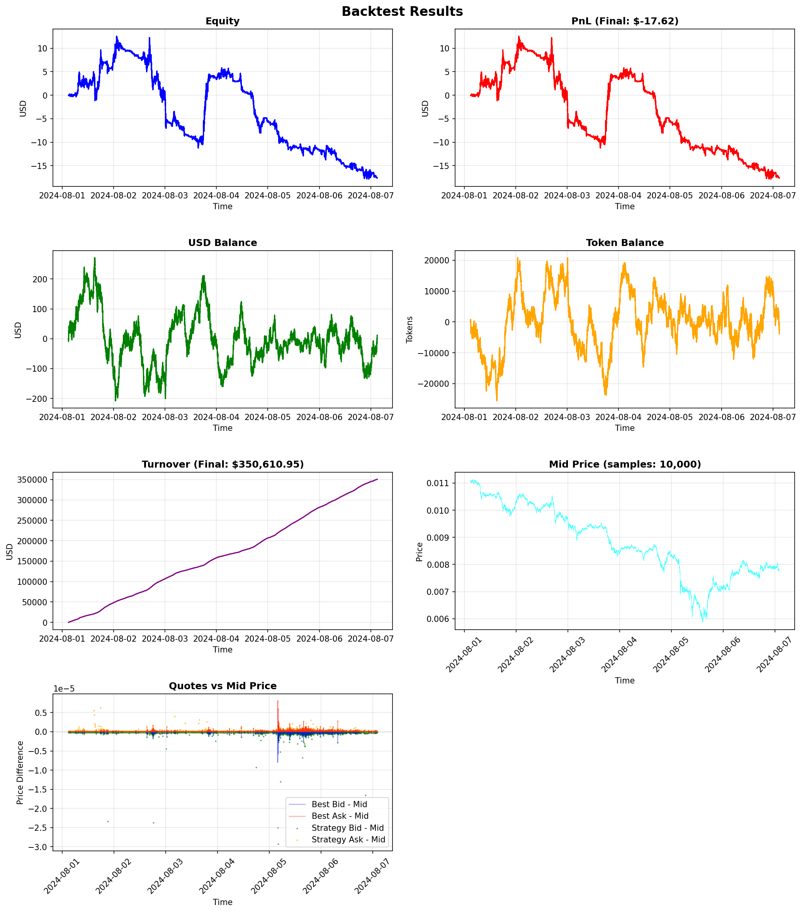

# HFT Market Making Backtester

A for-loop backtesting system for analyzing HFT market making strategies.

## Technical architecture



| Component | File | Responsibility |
|-----------|------|----------------|
| **Core** | `src/backtester/core/backtester.py` | Iterates over events from data provider |
| **DataProvider** | `src/backtester/data/provider.py` | Streaming events from dataset to data provider |
| **Strategy** | `src/backtester/strategy/avellaneda_stoikov.py` | Quote generation basing on market data |
| **Executor** | `src/backtester/executor/executor.py` | Filling detection |
| **Inventory** | `src/backtester/inventory/inventory.py` | Balance tracking |

## Avellaneda-Stoikov Implementation

### Volatility Estimation

- Rolling window of price changes
- Variance rate: `σ = sqrt(variance(price_changes))`
- Annualized: `σ_annual = σ × √(seconds_per_year / time_span)`
- Default window: 1000 samples
- Uses microprice instead of mid price

### Microprice Optimization

Microprice accounts for order book imbalance:

```
microprice = (bid_price × ask_vol + ask_price × bid_vol) / (bid_vol + ask_vol)
```

Benefits:
- Leads mid price when there's asymmetric volume
- Better signal for short-term price direction
- Reduces adverse selection by pricing in order flow pressure

### Cancellation Logic

Orders cancelled when:
```
|current_mid - placement_mid| > cancellation_threshold
```
New quotes immediately placed after cancellation.

## Model description

* Execution condition. When trade arrives and we have active limit orders, Executor compares trade price with our order price. If our price is better than the price in the trade, our limit order is filled – fully or partially.
* No commissions, no rebaits
* No latency
* No rate limiting from exchange
* Inventory can go negative, so we practically have infinite money

## Avellaneda-Stoikov Performance Analysis



### Grid Search Results

**Dataset:** 2M LOB, 30M trades (end of dataset)

**Best run:**
- gamma: 0.007
- k: 50,000,000
- order_volume: 50
- cancellation_threshold: 0.1 (disabled)
- **PnL: -$13.85**

### Explanation

**1. Downtrend**
Price was falling in the second part of the test window. So conservative gamma is better – we are inventory-risk averse because of the volatility of the token. However, a big gamma values was unable to make money in the first part of the test data, so PnL remains negative

**2. Cancellation Didn't Help**
Best params had cancellation disabled (0.1 threshold). It excacerbates situtation during downward trend because AS is practically unable to sell inventory during downward trend because of huge market shifts. 

**3. Probably, more optimal params exist**
I found some locally optimal solution but was unable to find the best one because of the limited compute.

**4. Microprice hadn't helped**
Unfortunately, microprice hadn't changed anything. Slight reservation price shifts hadn't help AS to mitigate downward trend, the problem was with inventory risk aversion

### Roadmap
#### Model improvements
1. Introduce commissions, rebaits
2. Introduce latencies and ratelimiting
3. Make inventory tokens and money amouns finite values

#### Strategy improvements
1. Calculate horizon dynamically
2. Introduce EWMA volatility function
3. Gridsearch more params to find a better local maximum
4. Toxicity filtering module can veto toxic orders

#### Technical Improvements
1. Make backtesting system event-driven to make it more flexible and easy to be adapted to live trading
2. Introduce persistent storages like DB and event brokers to make it able to work with bigger amount of data
3. Rewrite it in compiled languages with no GC like Rust or C++
4. Introduce multithreading
   
## Usage

### Setup

```bash
# Create virtual environment
uv venv
source .venv/bin/activate

# Install dependencies
uv pip sync pyproject.toml
```

### Run Backtest
```bash
PYTHONPATH=src python main.py
```

### Grid Search
```bash
PYTHONPATH=src python scripts/grid_search.py
```

### Analyze Data
```bash
PYTHONPATH=src python scripts/analyze_lob.py
PYTHONPATH=src python scripts/analyze_trades.py
```

### Convert CSV to Parquet
```bash
PYTHONPATH=src python scripts/convert_to_parquet.py
```

## Technical performance

### Backtest Technical Performance

**Dataset:** 2M LOB snapshots, 20M trades  
**Hardware:** Single core  
**Throughput:** ~75,000 events/sec  
**Runtime:** ~5 minutes

## Testing

```bash
PYTHONPATH=src python -m pytest tests/ -v
```

48 tests covering:
- Inventory tracking
- AS strategy (volatility, quotes, cancellation)
- Data provider streaming
- Chart generation

## Key Technical Design Decisions

1. **Scaled integers (1e8)** - Avoids floating-point precision issues in price calculations
2. **Single bid/ask order** - Simplifies executor state, matches typical MM behavior
3. **Cancel-and-replace** - Orders updated on every snapshot
4. **Trade-driven cancellation** - Mid-price drift checked on each trade
5. **Column projection** - Only reads required columns from wide parquet files
6. **Multiprocessing grid search** - Parallel hyperparameter optimization
