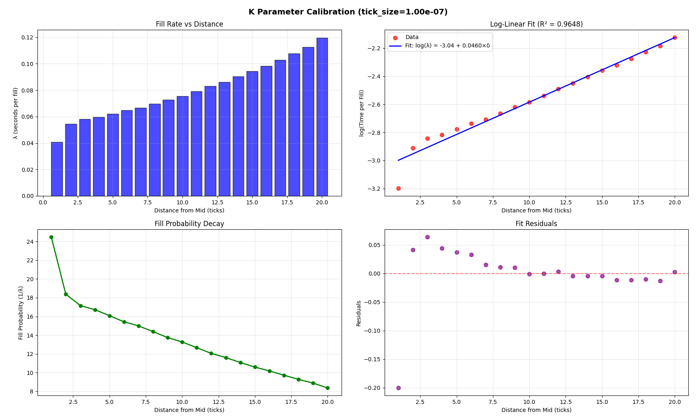
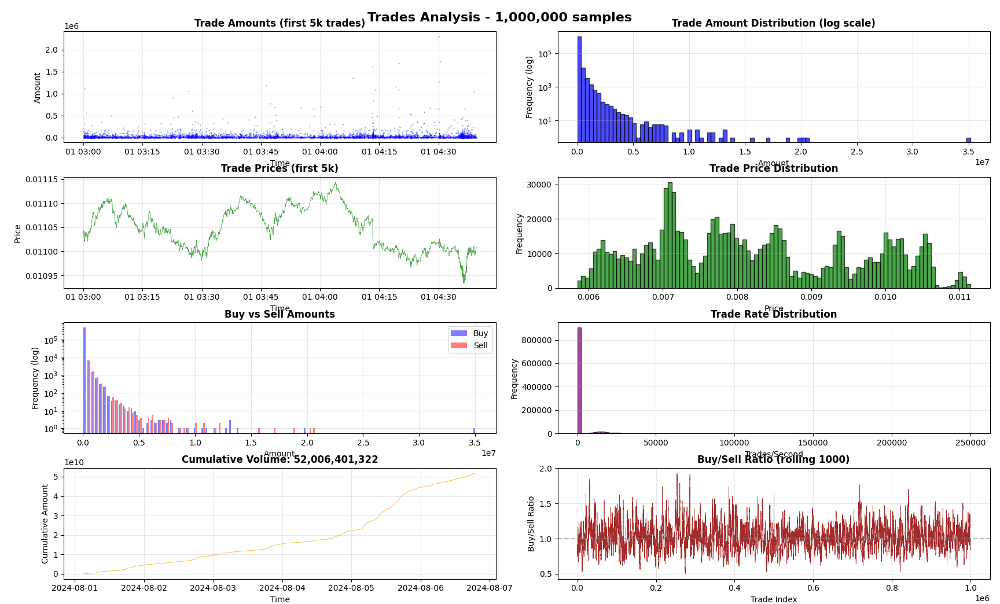
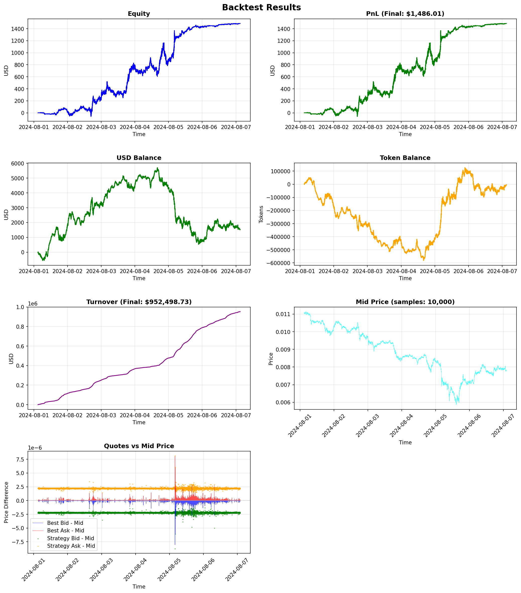

# Backtest Engine

## Model Description
* Execution condition. When trade arrives and we have active limit orders, Executor compares trade price with our order price. If our price is better than the price in the trade, our limit order is filled – fully or partially.
* Time has a logical nature – it moves forward with iteration over merged events of LOB and Trades
* No commissions, no rebaits
* No latency, no rate limiting from exchange
* Inventory can go negative, so we practically have infinite money

## Architecture


| Component | File | Responsibility |
|-----------|------|----------------|
| **Core** | `src/backtester/core/backtester.py` | Iterates over events from data provider |
| **DataProvider** | `src/backtester/data/provider.py` | Streaming events from dataset to data provider |
| **Strategy** | `src/backtester/strategy/avellaneda_stoikov.py` | Quote generation basing on market data |
| **Executor** | `src/backtester/executor/executor.py` | Filling detection |
| **Inventory** | `src/backtester/inventory/inventory.py` | Balance tracking |

## Scripts
1. __analyze_lob__ is investigating spreads, price volatility etc
2. __analyze_trades__ is investigating statistics of trades – volumes
 buy/sell ratio etc
3. __calibrate_k__ is designed to fit k parameter of AS model
4. __gridsearch__ is a script to adjust parameters in a multiprocess way

## Technical performance optimizations
* Converted csv to parquet to facilitate loading from a disk
* Used scaled int instead of float to avoid floating point precision issues and speed up computation
* Ignore all the levels but best bid/ask – it's not used in AS strategy
* Implemented a rolling variance calculation for volatility
  
### Backtest Technical Performance

**Dataset:** 2M LOB snapshots, 20M trades  
**Hardware:** Single core  
**Throughput:** ~75,000 events/sec  
**Runtime:** ~5 minutes
   

# AS performance analysis

## Steps

1. Figured out `tick_size` from data (0.0000001)
2. Divided dataset on train and validation sets (500k + 500k)
3. Adjusted `k` with train set with linear regression – **k=0.045985** 
4. Adjusted gamma with gridsearch – `gamma=0.2`
5. Chose `horizon_seconds` to minimize drowdown – **0.5 seconds**.
6. Tried **conditional cancellation** (midprice drift), but it doesn't helped to maximize PnL
7. Found appropriate fixed trade volume from data – p25 of trade volumes 
8. Introduced microprice to improve quote generation

So final config is:
```
strategy:
  id: avellaneda_stoikov
  order_volume: 50000000000  # 500 * 1e8 (scaled integer)

avellaneda_stoikov:
  gamma: 0.2
  k: 0.045985
  volatility_window: 10000
  horizon_seconds: 0.5
  min_spread: 0.0000001
  max_spread: 0.1
  tick_size: 0.0000001
  cancellation_threshold: 0.5 # practically disabled
```
   
## Results
* Final PnL is **15 bps – 1486\$ with turnover 952498\$**


Looks like, that further decrease of inventory aversion does not lead to substantial increase of profit


### Roadmap
#### Model improvements
1. Introduce commissions, rebaits
2. Introduce latencies and ratelimiting
3. Make inventory tokens and money amounts finite values

#### Strategy improvements
1. Calculate horizon dynamically
2. Improve volatility function (EWMA etc)
3. Gridsearch more params to find a better local maximum
4. Toxicity filtering module can veto toxic orders

#### Technical Improvements
1. Make backtesting system event-driven to make it more flexible and easy to be adapted to live trading
2. Introduce persistent storages like DB and event brokers to make it able to work with bigger amount of data
3. Rewrite it in compiled languages with no GC like Rust or C++
4. Introduce multithreading